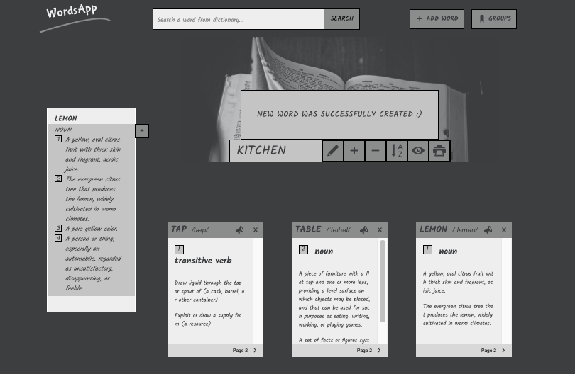
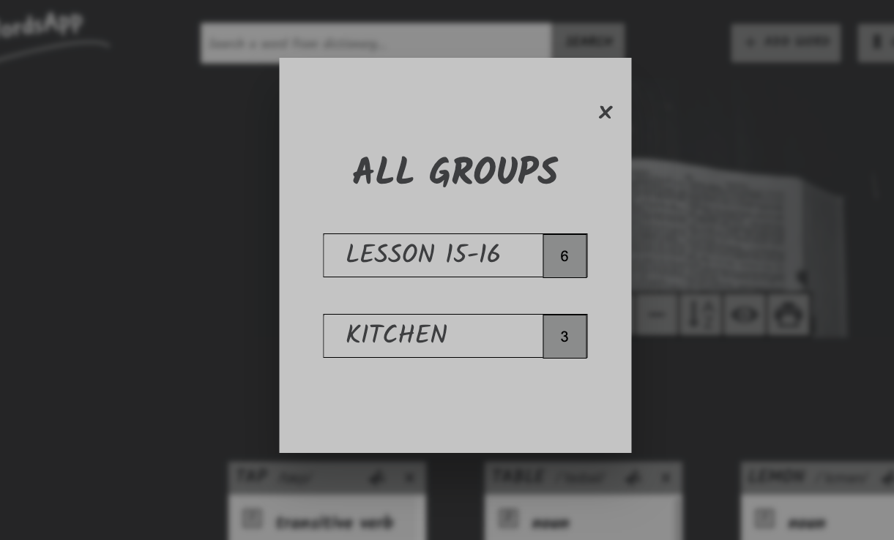
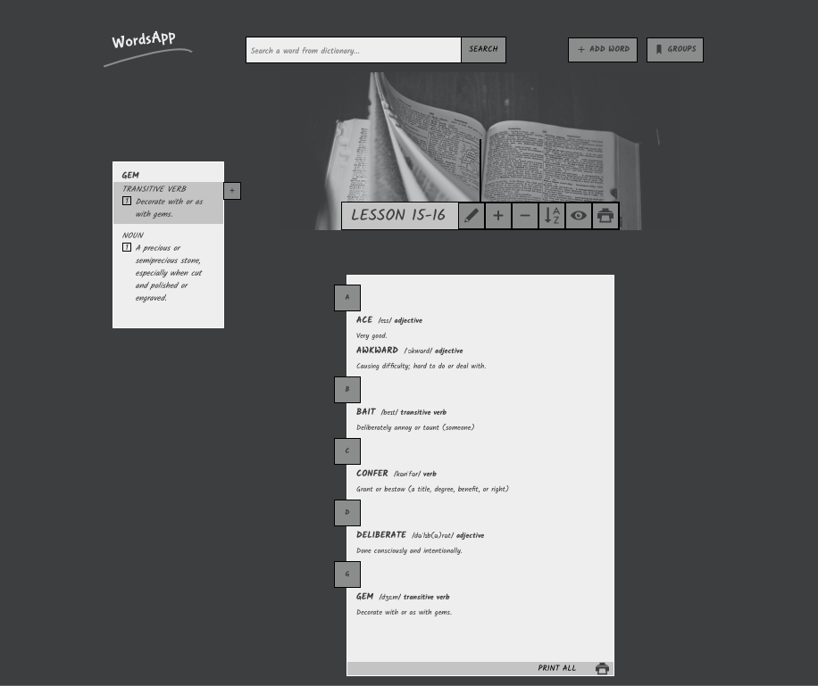
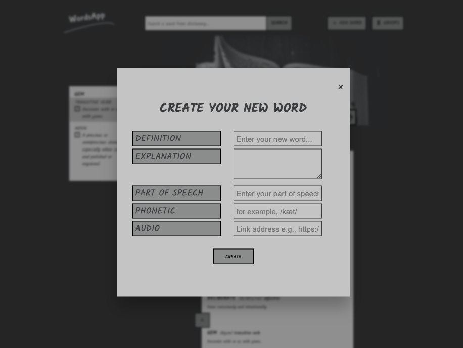
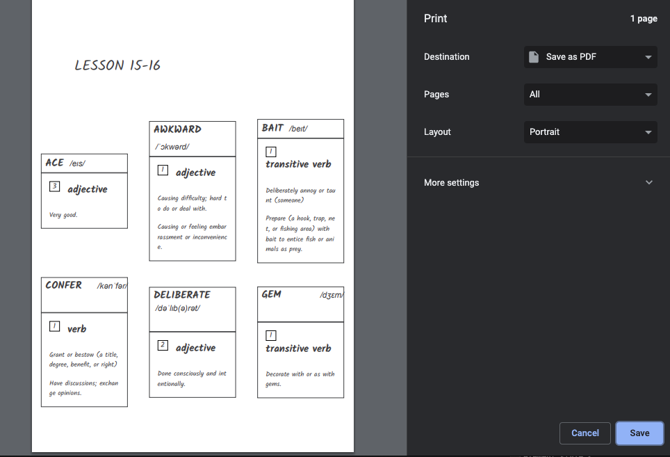
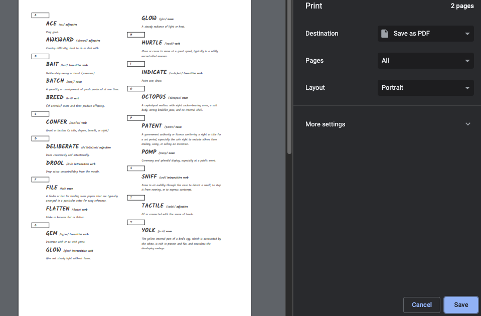
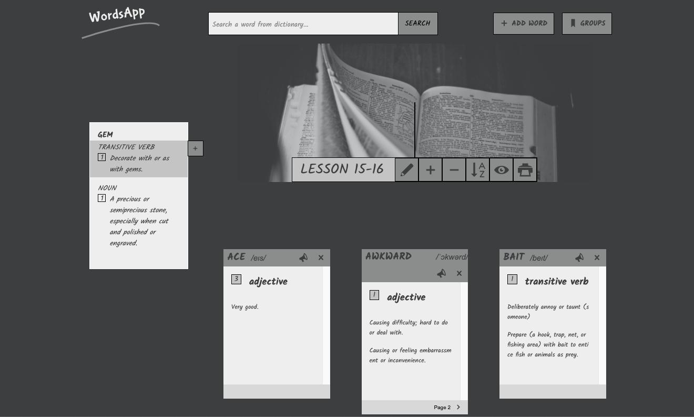

**wordsApp** is an application built to help you learn new words by grouping them and print on special preformatted lists. You can also create your cards with any voluntary content for an instance shopping list.

just visit [gregsypek.github.io/wordsApp](http://gregsypek.github.io/wordsApp)!

### Features

- nice UI
- no accounts necessary
- intuitive
- extensible
- localStorage persistence
- two different printing output: as a list or as cards
- etc.

### Why wordsApp? What's it for?

Something simple and intuitive that helps to learn foreign languages with a built-in search input connected with a dictionary API.

[https://dictionaryapi.dev] (https://dictionaryapi.dev)

#### A list of supported language codes:

| Language Code | Language             |
| ------------- | -------------------- |
| en_US         | English (US)         |
| hi            | Hindi                |
| es            | Spanish              |
| fr            | French               |
| ja            | Japanese             |
| ru            | Russian              |
| en_GB         | English (UK)         |
| de            | German               |
| it            | Italian              |
| ko            | Korean               |
| pt-BR         | Brazilian Portuguese |
| ar            | Arabic               |
| tr            | Turkish              |

For now, WordsApp used only the English (US) language. In the future, I will add a search option with all of them.

It started as a vanilla JS with a Model View Controller architecture.

No accounts necessary and the source isn't too hard to grasp making it rather easy to extend and customise.

### Who's it for?

wordsApp is for people like me who prefers writing notes by keyboard rather than by pen. It takes less time and if you want wordsApp easily prints your words on paper.

### Using wordsApp

Just want to use it? Do that by visiting [gregsypek.github.io/wordsApp](http://wordsapp.netlify.app).

Changes are persistent thanks to `localStorage`.

##### Prerequisites

If you're cloning the repo and setting up the codebase you are going to need **node**(\_preferably **yarn\_**) and **gulp** installed.

##### Set up

1.  Clone the repo.

        git clone https://github.com/gregsypek/wordsApp.git

2.  Navigate into the repo and install the dependencies.

        cd wordsApp
        yarn (alternatively, npm install)

#### Under the hood

There are a range of technologies being used under the hood.

- Node
- Vanillia JS
- Sass
- Parcel

### License

MIT

---

Made with [@gregsypek](https://twitter.com/@gregsypek) 2021
